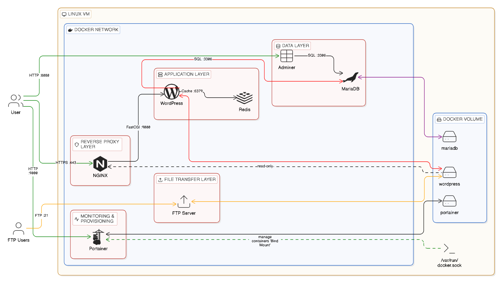

*This project has been created as part of the 42 curriculum by ymazini.*

# Inception (42 Project)



## Description
Inception is a system administration project designed to broaden knowledge of Docker and containerization. The goal is to set up a small infrastructure composed of different services running under specific rules in a virtual machine. This project stack (Nginx, MariaDB, WordPress + PHP-FPM) alongside several bonus standalone services (Redis, FTP, Adminer, Portainer as my choice, and a Static Website), all orchestrated with `docker compose`.

## Instructions

### Prerequisites
- Docker Engine
- Docker Compose plugin
- `make` utility

### Installation & Execution
1. Clone the repository and navigate to the project root.
2. Ensure you have the `secrets/` directory created with the required password files (`db_password.txt`, `wp_password.txt`, etc.).
3. Configure your local `/etc/hosts` to point `ymazini.42.fr` to `127.0.0.1`.
4. Run the project:
   ```bash
   make
   ```
5. To stop the containers without destroying your volumes:
   ```bash
   make down
   ```

## Resources and AI Usage
- [Docker Official Documentation](https://docs.docker.com/)
- [Nginx Documentation](https://nginx.org/en/docs/)
- [vsftpd Configuration Options](https://security.appspot.com/vsftpd/vsftpd_conf.html)
- [Adminer](https://www.adminer.org/)
- [Portainer](https://www.portainer.io/)
- [WordPress Docker Guide](https://developer.wordpress.org/apis/cli/commands/docker/)
- [MariaDB Docker Docs](https://hub.docker.com/_/mariadb)
- [Redis Docker Docs](https://hub.docker.com/_/redis)
- [Docker Deep Dive PDF](http://103.203.175.90:81/fdScript/RootOfEBooks/E%20Book%20collection%20-%202024%20-%20D/CSE%20%20IT%20AIDS%20ML/Docker%20Deep%20Dive.pdf)


**AI Usage:**

AI was used to help write and structure the documentation (`README.md`, `USER_DOC.md`, and `DEV_DOC.md`) to ensure the correct syntax and formatting. I also used AI 'NotebookLM' to help me understand best practices of modern container orchestration and to do a deep dive into Docker's internals and Following the good practices.


## Technical Architecure & Design Choices

The core design philosophy is total isolation. Each service runs entirely in its own container, using custom-built Alpine/Debian images rather than pulling pre-configured images from DockerHub.

### Virtual Machines vs Docker
Virtual Machines virtualize the entire hardware stack, requiring a full, heavy guest Operating System for every instance. Docker virtualizes at the OS-level, allowing containers to share the host system's kernel. Docker is astronomically lighter, boots in seconds instead of minutes, and requires far less memory, making it perfect for deploying microservice architectures like this LEMP stack.

### Secrets vs Environment Variables
Environment variables (`.env`) are excellent for non-sensitive configuration data (like domain names or usernames), but they can easily leak in crash logs, `docker inspect` outputs, or shell histories. Docker Secrets physically mount sensitive passwords as encrypted, temporary, read-only files inside the container's RAM, ensuring passwords (like `db_root_password`) are never exposed to the environment space.

### Docker Network vs Host Network
Using the Host Network would bind the containers directly to the VM's physical ports, destroying all isolation. By creating a custom Docker bridge network (`docker-network`), the containers exist in a secure internal tunnel where they can communicate via DNS (e.g., WordPress pinging MariaDB). The only way the outside world can interact with the system is through the explicitly exposed ports (443 for Nginx).

### Docker Volumes vs Bind Mounts
Bind Mounts are hardcoded paths directly linking a folder on the host to a folder in the container (often used in development to see live code edits). Docker Named Volumes are securely managed directly by the Docker Daemon. In this project, i use a hybrid approach (Driver Option Bind mounts) to legally adhere to the subject requirement of physically storing the database and web files in `/home/ymazini/data/` while still allowing Docker to internally orchestrate the persistence.